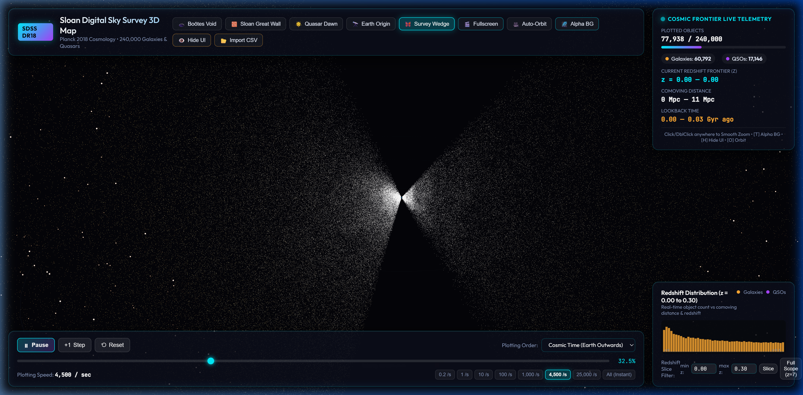
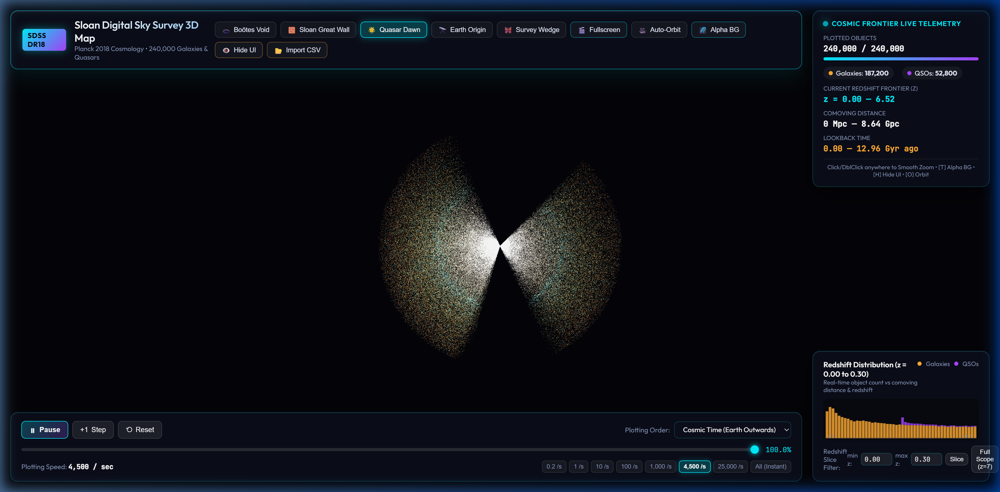

# 🌌 CosmoVerse-3D: Interactive SDSS DR18 Galaxy & Quasar Map

[](https://threejs.org/)
[](https://www.khronos.org/webgl/)
[](https://vitejs.dev/)
[]()
[]()

**CosmoVerse-3D** is a high-performance interactive 3D WebGL cosmic map visualizing **240,000 celestial objects** (galaxies and quasars/QSOs) from the Sloan Digital Sky Survey (SDSS DR18). Powered by custom GLSL shaders and real-time **Planck 2018 Cosmological Model** computations, it maps redshift slices into accurate comoving distances and lookback times out to $z = 7.0$ (over 12.96 billion years back into cosmic history).

---

## 📸 Screenshots

### 1. Cosmic Web Survey Wedge & Glassmorphic Telemetry


### 2. Deep Quasar Dawn View ($z = 6.52$, 8.64 Gpc Comoving Distance)


---

## ✨ Key Features

- 💫 **240,000 GPU Point Cloud Particle Engine**
  Custom GLSL shaders (`galaxy.vert`, `galaxy.frag`) render high-density particle clouds with distance-based attenuation, dynamic glow halos, and spectral color mapping based on celestial object classification.

- 🔭 **Planck 2018 Cosmological Model Integration**
  Accurate astronomical calculations based on $H_0 = 67.4 \text{ km/s/Mpc}$ and $\Omega_m = 0.315$. Automatically computes:
  - Redshift $z \rightarrow$ Comoving Distance ($\text{Mpc} / \text{Gpc}$)
  - Lookback Time ($\text{Gyr}$)
  - Angular Diameter & Luminosity Distances

- ⚡ **Streamed Progressive Data Engine**
  Simulates live telescope data ingestion stream from 0.2 objects/sec up to 25,000 objects/sec, with an interactive timeline scrubber and instant dataset plotting options.

- 📊 **Real-time Redshift Histogram & Slice Filtering**
  Interactive distribution graph showing object counts across redshift bins ($z = 0.0$ to $z = 7.0$). Filter specific cosmic epochs dynamically.

- 🛸 **Cyberpunk Glassmorphic Sci-Fi HUD**
  Sleek dark-mode interface with live cosmic telemetry counters, camera presets (**Boötes Void**, **Sloan Great Wall**, **Quasar Dawn**, **Earth Origin**, **Survey Wedge**), auto-orbit controls, and CSV dataset import/export.

- 🛰️ **Live SIMBAD Catalog (real observations)**
  One click swaps the synthetic catalog for ~40,000 real galaxies and quasars
  queried live from the [SIMBAD TAP service](https://simbad.cds.unistra.fr/simbad/sim-tap)
  at CDS Strasbourg — real RA/Dec and measured redshifts out to $z \approx 7$,
  projected through the same Planck 2018 model.

- 🏷️ **Named Objects & Labels**
  A curated set of identified objects — Messier galaxies, clusters, superclusters, voids and famous quasars — is plotted at true coordinates alongside whichever catalog is loaded. Labels are zoom-gated: nearby galaxies surface once you fly into the local volume, large-scale structures label at survey scale. Click any named object for its catalogue IDs, coordinates, redshift, distance and lookback time.

- 📱 **Camera Passthrough AR**
  View the map through your device camera. The survey floats as a fixed object in the room — move the phone to look around it, pinch to change its apparent size, and tap **Recentre** to bring it back in front of you. Needs a secure context (HTTPS) and a motion sensor; without a gyroscope it falls back to drag-to-look over the live feed.

- 🔍 **Interactive Object Inspector & Spectrum Visualizer**
  Click on any celestial object to view detailed astronomical telemetry:
  - Celestial Coordinates ($\text{RA}, \text{DEC}$)
  - SDSS Photometric Band Magnitudes ($u, g, r, i, z$)
  - Stellar Mass ($M_\odot$) & Morphological Class (Spiral, Elliptical, Quasar)
  - Simulated Dynamic Spectral Emission Profile

---

## 🌐 Data Sources

| Source | How it loads | Notes |
| :--- | :--- | :--- |
| **Synthetic SDSS DR18 catalog** | Generated in-browser at startup | 240,000 objects with a modelled cosmic web, Boötes Void and Sloan Great Wall. Instant and offline. |
| **SIMBAD (CDS Strasbourg)** | 🛰️ **Load SIMBAD** button in the header | ~40,000 **real** galaxies and quasars with measured redshifts, fetched live over the SIMBAD TAP `/sync` endpoint. |
| **Custom CSV** | 📂 **Import CSV** button | Any table with `ra`, `dec`, `z` and an optional `class` column. |

### How the SIMBAD query works

`src/data/simbadSource.js` posts ADQL to `https://simbad.cds.unistra.fr/simbad/sim-tap/sync`.
ADQL's `TOP` has no `ORDER BY`, so a single query returns whichever rows the
server indexes first — heavily biased to the nearby universe. The fetch is
therefore split into **redshift bands** that are requested in parallel:

```
galaxies  z ∈ (0.0005, 0.02] (0.02, 0.1] (0.1, 0.5] (0.5, 2.0] (2.0, 7.5]
quasars   z ∈ (0.1, 1.0]  (1.0, 2.5]  (2.5, 4.0]  (4.0, 7.5]
```

Galaxy bands filter on `otype = 'Galaxy..' AND otype != 'QSO..'` — the `..`
suffix matches a whole SIMBAD type hierarchy, and the QSO subtree sits under
Galaxy, so it is subtracted to keep the two families disjoint. A band that
fails is reported via `failedBands` rather than failing the whole load, and
rows with non-finite or out-of-range coordinates are dropped before they reach
the GPU buffers.

No API key is required, and SIMBAD serves `Access-Control-Allow-Origin: *`, so
the browser talks to it directly with no proxy.

---

## 🛠️ Technology Stack

| Technology | Purpose |
| :--- | :--- |
| **Three.js (r185)** | 3D WebGL rendering engine & camera management |
| **Custom GLSL Shaders** | High-performance vertex & fragment particle rendering |
| **JavaScript (ES Modules)** | Core application logic & cosmological equations |
| **Vite** | Next-generation fast frontend tooling & development server |
| **Vanilla CSS3** | Glassmorphism UI tokens, micro-animations & dark mode styling |
| **Lucide Icons** | Vector icons for astronomy UI navigation |

---

## 🚀 Getting Started

### Prerequisites

Make sure you have [Node.js](https://nodejs.org/) (v16+ recommended) installed on your machine.

### Installation

1. **Clone the repository**
   ```bash
   git clone https://github.com/developerrahulofficial/CosmoVerse-3D.git
   cd CosmoVerse-3D
   ```

2. **Install dependencies**
   ```bash
   npm install
   ```

3. **Fetch the named-object catalogue** (optional)
   ```bash
   npm run fetch:named
   ```
   Queries SIMBAD for real galaxies, clusters and quasars and writes `src/data/namedObjects.json`. The repository ships this file empty; without this step the map renders normally but carries no labels.

4. **Start local development server**
   ```bash
   npm run dev
   ```
   Open your browser at `http://localhost:5173` to explore the universe!

5. **Build for production**
   ```bash
   npm run build
   ```

---

## 🎮 Controls & Keyboard Shortcuts

| Input | Action |
| :--- | :--- |
| **Left Click + Drag** | Orbit camera around cosmic origin |
| **Right Click + Drag** | Pan camera |
| **Scroll Wheel** | Zoom in / out through cosmic structures |
| **Click Object** | Inspect galaxy / quasar properties & spectrum |
| **`[T]`** | Toggle HUD glass background transparency |
| **`[H]`** | Hide / Show UI overlays |
| **`[O]`** | Toggle smooth auto-orbit camera rotation |

---

## 📂 Project Structure

```
CosmoVerse-3D/
├── docs/
│   └── screenshots/         # High-resolution application screenshots
│       ├── survey_wedge.png
│       └── quasar_dawn.png
├── scripts/
│   └── fetchNamedObjects.mjs # Builds the named-object catalogue from SIMBAD TAP
├── public/                  # Static web assets & favicon
├── src/
│   ├── assets/              # Textures & graphics
│   ├── controller/          # PlottingController stream logic
│   ├── cosmology/           # Planck 18 cosmological distance model
│   ├── data/                # Catalog sources
│   │   ├── sdssGenerator.js # Synthetic SDSS DR18 generator + CSV import + buildCatalog()
│   │   └── simbadSource.js  # Live SIMBAD TAP (ADQL) client
│   ├── rendering/           # Three.js scene, camera damping & GLSL shaders
│   │   └── shaders/         # galaxy.vert & galaxy.frag
│   ├── ui/                  # HUD, spectrum visualizer & control panels
│   ├── main.js              # Application entry point
│   └── style.css            # Sci-fi glassmorphic styling system
├── index.html               # Main HTML entry point
├── package.json
└── README.md
```

---

## 📄 License

Distributed under the MIT License. See `LICENSE` for more information.

---

<p align="center">
  Designed & Built with 🌌 for Astronomy & Astrophysics Explorers by <a href="https://github.com/developerrahulofficial">developerrahulofficial</a>
</p>
